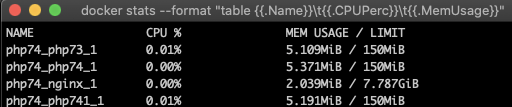
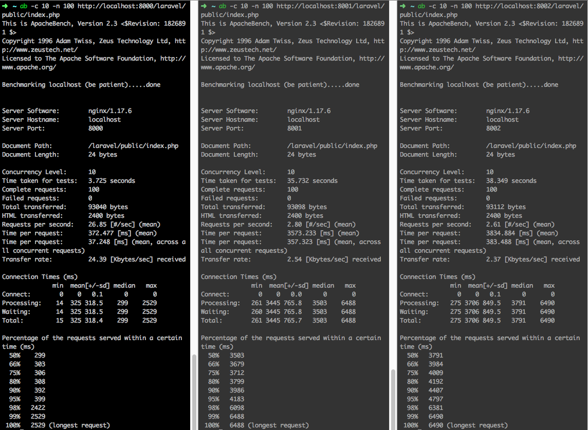

# PHP7.4 Preload 功能测试

> PHP7.4已经发布，发布了很多新特性，其中有一项功能比较吸引人，那就是预加载功能，可以将文件提前加载到内存当中，据说可以提升PHP性能，但是究竟是不是能提升，能提升多少，我们可以做一个实验来测试下。

## 思路
> 预加载的原理就是将类提前加载到内存中，这种提升在fpm场景下最适合，所以笔者做了以下几个角度的测试。
1. 速度测试：比较php7.4预加载、php7.4无预加载、php7.3三种环境下，同一份文件访问的表现
2. 空间测试：也就是上面三种环境下内存使用情况
3. CPU使用的情况可以忽略，因为下面的测试使用了docker，已经将cpu使用率降低到了25%

## 工具

1. php项目：

    1) 在www目录下面，默认访问的是index.php文件，里面引用了www/Dog目录下的三个文件(增加文件读取操作);
    2) 为了验证预加载确实读取类到了内存中，增加了dog类

2. 使用docker-compose编排了三个php环境分别是php7.4预编译、php7.4普通、php7.3普通

    ```
      php74:
        image: php:7.4-fpm
        volumes:
          - ./www/:/var/www/html/:cached
          - ./php/preload.ini:/usr/local/etc/php/conf.d/preload.ini
        expose:
          - 9000
        deploy:
          resources:
            limits:
              cpus: '0.25'
              memory: 150M
      php741:
        image: php:7.4-fpm
        volumes:
          - ./www/:/var/www/html/:cached
        expose:
          - 9000
        deploy:
          resources:
            limits:
              cpus: '0.25'
              memory: 150M
      php73:
        image: php:7.3.9-fpm
        volumes:
          - ./www/:/var/www/html/:cached
        expose:
          - 9000
        deploy:
          resources:
            limits:
              cpus: '0.25'
              memory: 150M
    ```
    预加载比普通多了一个预加载的配置文件，把www/Dog里的文件进行了opcache_compile_file
    
    参考php/preload.ini和www/preload.php
3. 增加nginx配置，参考nginx/conf.d/default.conf

    | 环境  | Host |
    | --- | --- |
    |php7.4预加载 |http://localhost:8000/   |
    |php7.4无加载 |http://localhost:8001/   |
    |php7.3普通 |http://localhost:8002/   |

## 测试
> 打开2个窗口，分别执行下面的命令，不要关闭
```
  //监控docker容器的cpu使用和内存使用
  docker stats --format "table {{.Name}}\t{{.CPUPerc}}\t{{.MemUsage}}"
  
  //启动所有容器，必须使用--compatibility参数，否则CPU内存限制无效
  docker-compose --compatibility up
  
```
运行起环境后可以看到，php74_1是预加载环境，php741_1是无预加载环境，php73_1是php7.3环境，php7.4预加载环境已经比无预加载环境多使用了0.08Mib内存，至于是不是已经预加载了类，还不能下结论



下面采用ab来进行简单的压测，并用每秒请求数来进行对比
```
  ab -c 10 -n 1000 http://localhost:8000/
```


### 测试index.php
> 测试7.4预加载、7.4无预加载、7.3三种环境的表现

| 环境和地址  | 第1次 | 第2次| 第3次| 第4次 | 第5次 |
|---|---|---|---|---|---|
|7.4预加载；http://localhost:8000/   | 268 | 367  | 410  | 345  | 359  |
|7.4无预加载；http://localhost:8001/   | 153  | 180  | 160  | 137  | 190  |
|7.3；http://localhost:8002/   | 154  | 110  | 126  | 134  | 131  |


### 测试dog.php
> dog.php包含了Dog文件夹下的内容，主要测试dog类，是否已经在内存中。用curl访问即可，或者浏览器打开

| 环境和地址  | 运行结果 | 
|---|---|
|7.4预加载；http://localhost:8000/dog.php   | Cannot declare interface AnimalInterface, because the name is already in use in <b>/var/www/html/dog.php |
|7.4无预加载；http://localhost:8001/dog.php   | It is runningWang! Wang!  |
|7.3；http://localhost:8002/dog.php   | It is runningWang! Wang!  | 

### 测试cat.php
> cat.php包含cat类，就是将dog类改了下名字全部放到了cat.php文件中，减少文件读写；主要测试在文件读写次数一致的情况下程序的表现

| 环境和地址  | 第1次 | 第2次| 第3次| 第4次 | 第5次 |
|---|---|---|---|---|---|
|7.4预加载；http://localhost:8000/cat.php   | 334 | 305  | 337  | 395  | 366  |
|7.4无预加载；http://localhost:8001/cat.php   | 282  | 201  | 221  | 213  | 269  |
|7.3；http://localhost:8002/cat.php   | 219  | 247  | 216  | 295  | 254  |

## 总结

1. php7.4开启预加载，性能确实提升了很多，原因就是大幅度减少了文件读取的时间
2. 未开启预加载的情况下，php7.3和php7.4性能差距不大
3. php7.4开启了预加载后，但是并没有预加载特定文件(Cat类)性能居然也有提升，原因还不得而知???
4. 从第二个测试来看php7.4开启预加载之后，类确实加载到了内存中，这就是提升效率的关键，但是在实际项目中，这个特性可能会因为不熟悉特性重复定义类导致项目报错挂掉(潜在的风险)
5. 没有做关于laravel的测试，因为不想做了，原理差不多
6. 在实际应用中，应该对经常使用的类进行热加载，而不要全部加载，参考下面第二个文献

---
## 最终还是做了Laravel的测试，见图
> laravel项目是6.5版本，只修改了route/web.php，把默认返回值改成了一个json，其他均未修改

貌似php7.4只要开启preload，不需要配置preload文件也能加快访问速度(原理未知，可能是自动缓存了，如果是自动缓存，那么后期更新项目就需要重启fpm，不然会有问题)，所以我在www目录下面放入了一个laravel项目，然后用ab 进行了压测，压测结果特别低是因为对容器的CPU和内存做了限制。

从2，3图来看，没有开启preload的php7.4与php7.3性能相差无几，但是开启了preload的php7.4，提升还是很明显的，降低了非常多的文件读取性能消耗




## 参考文献

1. [Composer: How it should preload in PHP 7.4](https://medium.com/swlh/composer-how-it-should-preload-in-php-7-4-3f8d19fda40)
2. [国外同行做的测试，可能是基于laravel](https://github.com/composer/composer/issues/7777#issuecomment-440268416)
3. [Preloading in PHP 7.4](https://stitcher.io/blog/preloading-in-php-74)
4. [在 Docker Compose file 3 下限制 CPU 與 Memory](https://blog.yowko.com/docker-compose-3-cpu-memory-limit/)
